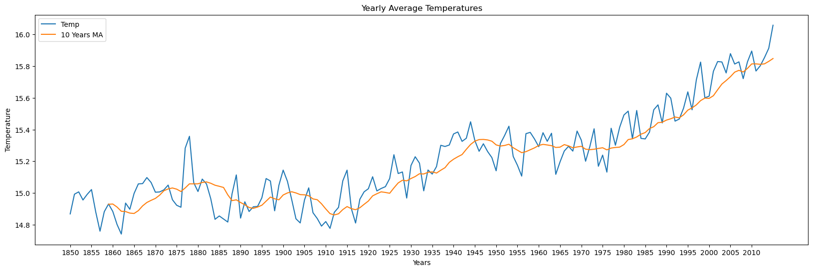

# Climate Change Forecast with SARIMA

This project uses [Seasonal ARIMA (SARIMA)](https://online.stat.psu.edu/stat510/lesson/4/4.1) models to forecast global average temperatures based on historical data from 1850 to 2015. The analysis aims to predict future temperature trends and quantify potential climate change impacts.

## Dataset

The analysis uses the [Berkeley Earth dataset](https://www.kaggle.com/datasets/berkeleyearth/climate-change-earth-surface-temperature-data) from Kaggle, which provides monthly average global surface temperatures from 1850 to 2015.

## Methodology

1. Data Preprocessing
2. Exploratory Data Analysis
3. Stationarity Testing
4. SARIMA Model Selection
5. Model Validation
6. Future Temperature Forecasting

## Key Findings

- The pre-industrial average global surface temperature (1850-1900) was approximately 15.0°C.
- There is a clear upward trend in global temperatures over the analysed period.
- The SARIMA model predicts a 4.4°C increase in average global surface temperature by the year 2100 compared to pre-industrial levels by tuning the hyperparameters for the worst case scenario([SSP5-8.5](https://www.ipcc.ch/report/ar6/wg1/downloads/report/IPCC_AR6_WGI_SPM.pdf)).

## Visualisations

### Global Temperature Variation (1850-2015)

### Monthly Global Temperatures

### Yearly Average Temperatures

### SARIMA Model Forecast vs Actual (Test Set)

### Long-term Temperature Forecast

## Model Performance

- The SARIMA model outperformed the baseline in both validation and test sets.
- Test Set RMSE:
  - Baseline: 0.6402°C
  - SARIMA model: 0.1584°C

## Dependencies

- numpy
- pandas
- seaborn
- statsmodels
- matplotlib
- scikit-learn
- tqdm

## Usage

1. Clone this repository `git clone https://github.com/guyanik/climate-change-forecast.git`
2. Navigate to the project directory `cd climate-change-forecast`
2. Install the required dependencies: `pip install -r requirements.txt`
3. Run the Python script: `python climate_change_forecast.py`

## Future Work

- Incorporate additional climate variables (e.g., CO2 levels, solar activity)
- Explore ensemble methods for improved forecasting
- Analyse regional temperature variations

## License

This project is licensed under the MIT License - see the [LICENSE](LICENSE) file for details.

## Acknowledgments

- [Berkeley Earth](https://berkeleyearth.org/) for providing the temperature dataset
- [Kaggle](https://www.kaggle.com/) for hosting the data
- [Leandro Rabelo](https://www.kaggle.com/code/leandrovrabelo/climate-change-forecast-sarima-model/notebook) for the initial inspiration